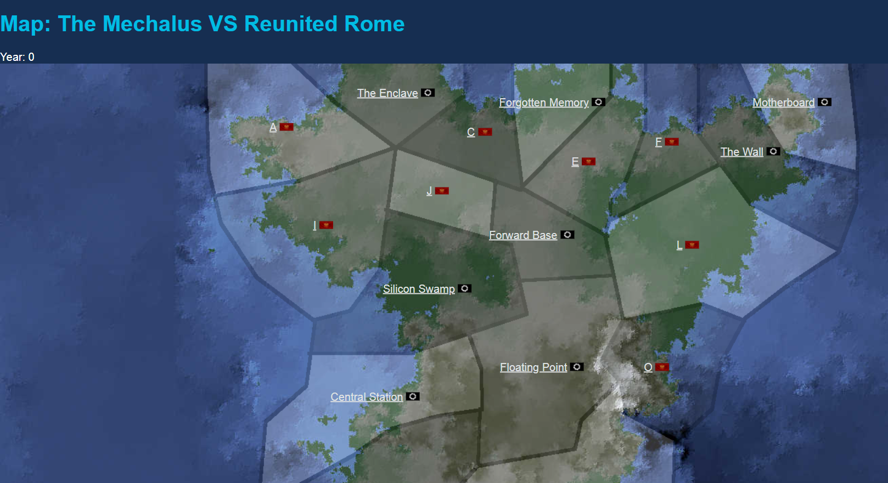

# NSImperialism

An optional extension to https://www.nationstates.net/ to simulate geographic interactions between nations and AI opponents. This project was previously live at https://nsimperialism.net/ but is currently defunct. The idea was to have multiple players join a map and interact while an AI opponent empire tries to expand. The intention was to show how collaboration between nations would help defend against an aggressor.

The name is based on [NSEconomy](http://www.broomdces.com/nseconomy/) which is a similar project but for economics and budgets.

