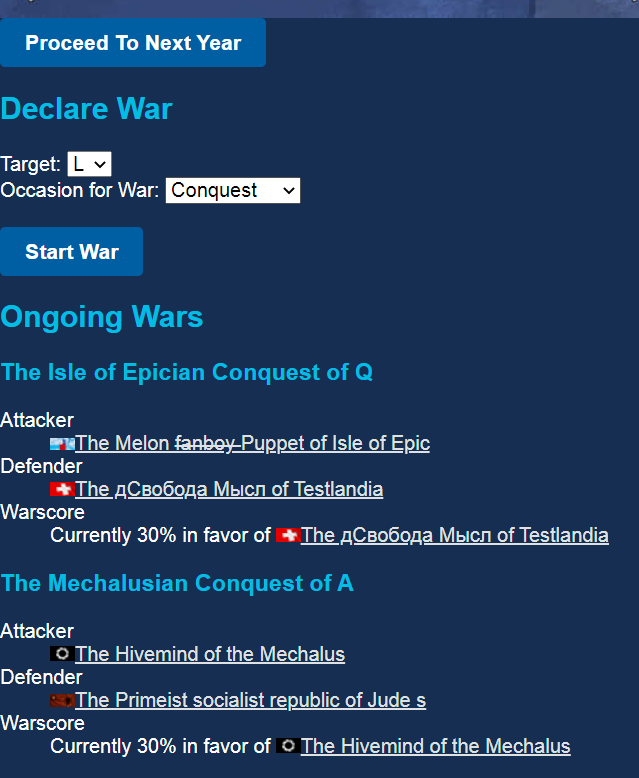

# NSImperialism

An optional extension to https://www.nationstates.net/ to simulate geographic interactions between nations. Like [NSEconomy](http://www.broomdces.com/nseconomy/) but for imperialism and warfare instead of economics and budgets. This was previously live at https://nsimperialism.net/ but is currently defunct.

